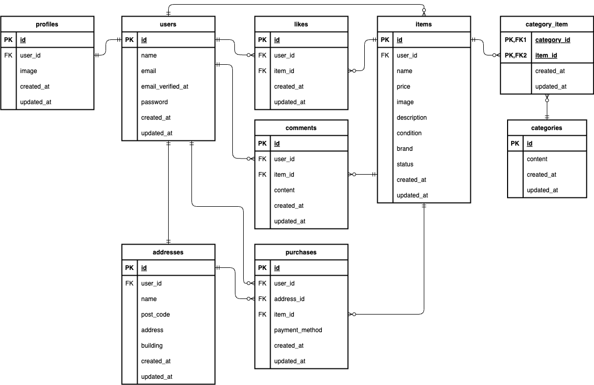

# フリマアプリ

## 環境構築

### Docker ビルド

1. `git clone git@github.com:tkdisk49/flea-market.git`
2. `docker-compose up -d --build`

> Mac の M3 チップの PC で構築しているので、`docker-compose.yml` ファイルの「mysql」「phpmyadmin」「mailhog」内に「platform」の項目を追加しています。  
> エラーが発生する場合は、「platform」の項目を削除して再度ビルドを実行してください。

```text
mysql:
    image: mysql:8.0.26
    platform: linux/amd64(この文を削除)

phpmyadmin:
    image: phpmyadmin/phpmyadmin
    platform: linux/amd64(この文を削除)

mailhog:
    image: mailhog/mailhog
    platform: linux/amd64(この文を削除)
```

### Laravel 環境構築

1. `docker-compose exec php bash`
2. `composer install`

> `composer install` の際にエラーが発生する場合は、`composer update` を実行してから再度インストールしてください。

```bash
composer update
```

3. `env.example`ファイルから`.env`を作成し、環境変数を変更

```env
DB_CONNECTION=mysql
DB_HOST=mysql
DB_PORT=3306
DB_DATABASE=laravel_db
DB_USERNAME=laravel_user
DB_PASSWORD=laravel_pass

MAIL_MAILER=smtp
MAIL_HOST=mailhog
MAIL_PORT=1025
MAIL_USERNAME=null
MAIL_PASSWORD=null
MAIL_ENCRYPTION=null
MAIL_FROM_ADDRESS=noreply@example.com
MAIL_FROM_NAME="${APP_NAME}"

STRIPE_KEY= (Stripe API 公開可能キー)
STRIPE_SECRET= (Stripe API シークレットキー)
```

> Stripe API キーの取得に関しては後述しています

4. アプリケーションキーの作成

```bash
php artisan key:generate
```

5. マイグレーションの実行

```bash
php artisan migrate
```

6. シンボリックリンクの作成

```bash
php artisan storage:link
```

7. シーディングの実行

```bash
php artisan db:seed
```

### PHPUnit テスト環境構築

PHPUnit テストは、データベースに SQLite の`:memory:` を使用しています。
そのため、テスト実行時にデータベースの内容は保持されず、各テスト実行ごとにリセットされます。

1. テスト用アプリケーションキーの生成

```bash
php artisan key:generate --env=testing
```

2. テスト用データベースのマイグレーション

```bash
php artisan migrate --env=testing
```

3. テストの実行

```bash
php artisan test
```

## メール認証機能(Mailhog)

会員登録後にユーザー認証必須の項目にアクセスするには、メール認証が必要です。  
会員登録ページにて任意の情報を登録し、メール認証画面に遷移したら [Mailhog](http://localhost:8025/) へアクセスし認証を完了してください。

## Stripe テスト決済機能のセットアップ

商品を購入する際、購入ボタンを押下すると Stripe のテスト決済ページに遷移するようになっています。  
Stripe のアカウントを所持していない場合は、[Stripe](https://stripe.com/jp) から会員登録を行ってください。

1. ログイン後[Stripe ダッシュボード](https://dashboard.stripe.com/test/apikeys) から、自身のテスト用公開可能キーとシークレットキーを取得
2. `.env`ファイルの以下の項目に貼り付け

```env
STRIPE_KEY= 公開可能キー
STRIPE_SECRET= シークレットキー
```

3. 環境の更新

```bash
php artisan config:clear
php artisan cache:clear
```

## テストアカウント

テスト用のアカウントはメール認証済みです

### 出品用ユーザー

name: 出品ユーザー 1  
email: user1@example.com  
password: password

> item_id 1~5 の商品を出品しています

name: 出品ユーザー 2  
email: user2@example.com  
password: password

> item_id 6~10 の商品を出品しています

### 一般ユーザー

name: ユーザー  
email: user3@example.com  
password: password

## 補足説明

- AddressRequest の要件を満たすため、送付先住所変更フォームに「お名前」の欄を追加しています。それに伴い、商品購入画面の配送先にお名前が表示されるようにしています。

- 会員登録時のユーザー名は users テーブルに、プロフィール設定時のユーザー名は配送時に必要なお名前と解釈し、addresses テーブルに保存される設計にしています。

- テストケースのマイリスト一覧取得、未認証の場合は何も表示されない項目について、機能要件には「未認証ユーザーが、認証が必要なアクションをおこなった場合にログイン画面に遷移すること（他画面の押下など）」とありますので、そちらを優先し、未認証ユーザーがマイリストのタブを押下したらログイン画面に遷移する設計にしています。  
  テストケースもそれに準じて作成しています。

- 応用機能を追加したことにより、テストケースの期待挙動と実際の動作に差異が発生していることが多々ありました。応用機能を優先し、画面の遷移などは応用機能に準じたようにテストケースを作成しています。(会員登録後、メール認証画面に遷移する等)

- Stripe 決済機能を導入したことにより、テスト項目の商品購入機能の期待挙動と大幅にズレが生じたため、PurchaseController に store メソッドを残し、そちらを使用してテストを作成しております。  
  実際の開発環境での動作は、Stripe を使用した決済処理を実装しています。

- 決済処理完了後に不自然な挙動にならないよう、購入完了画面を作成し、そちらに遷移するようにしています。  
  また、追加した画面やビューファイルは基本設計書に追記しています。

## 使用技術（実行環境）

- PHP 8.3.11
- Laravel 8.83.29
- MySQL 8.0.26
- Composer
- Docker
- Mailhog(メール認証機能)
- Stripe(決済システム)
- JavaScript

## ER 図



## URL

- 開発環境:http://localhost/
- phpmyadmin:http://localhost:8080/
- mailhog:http://localhost:8025/
